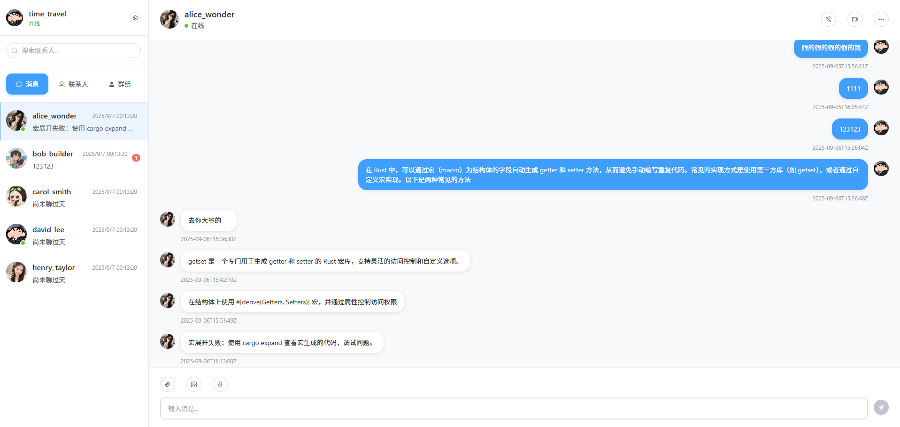
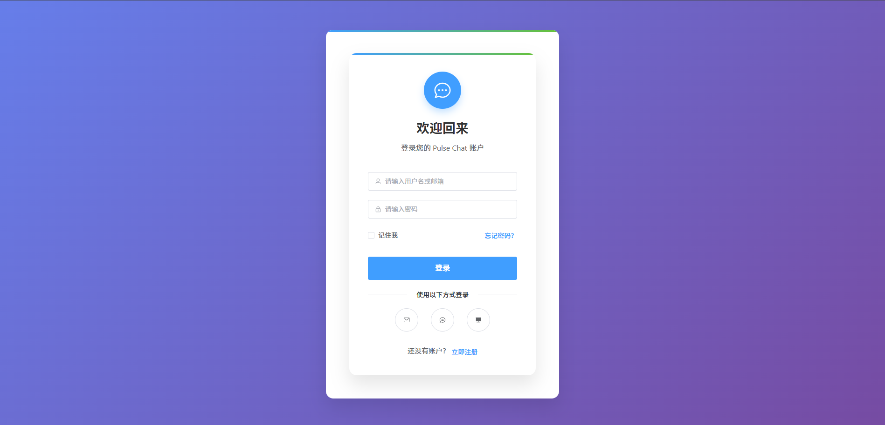
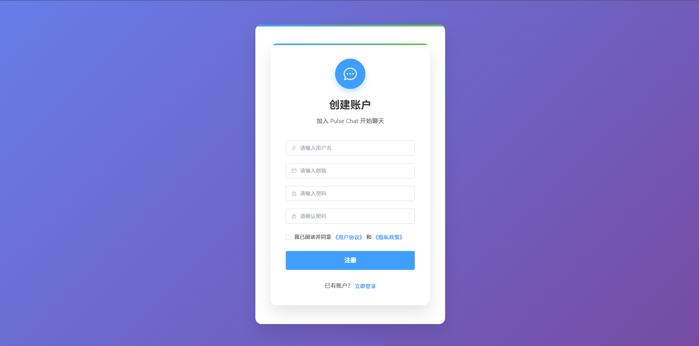
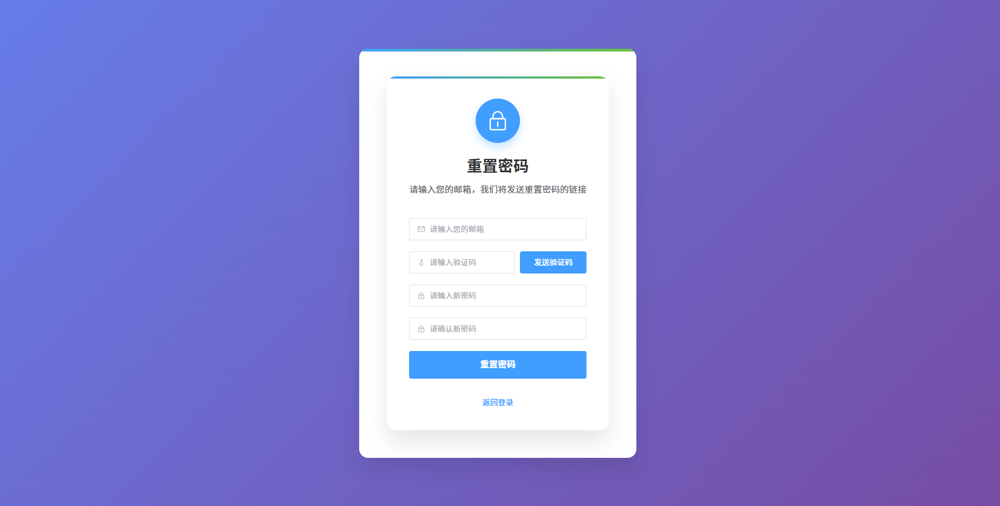

# Pulse Chat 项目需求文档

## 📋 项目概述

### 项目名称
Pulse Chat - 现代化实时聊天应用

### 项目描述
Pulse Chat 是一个基于 Web 的实时聊天应用，旨在提供流畅的用户体验和丰富的社交功能。它支持单聊和群组聊天，具备智能联系人管理、文件传输、个性化设置等功能。采用 Vue 3 + Element Plus 技术栈，界面简洁美观，响应式设计适配多设备，为用户提供完整的即时通讯解决方案。

### 项目目标
1.  **构建功能完整、界面美观、体验流畅的即时通讯解决方案**：提供稳定可靠的核心聊天功能，并注重用户交互体验。
2.  **实现实时消息推送、联系人管理、群组聊天等核心功能**：确保消息实时送达，管理逻辑清晰。
3.  **提供安全可靠的用户认证和数据保护机制**：保障用户数据和通信安全。
4.  **支持多设备访问和响应式设计**：用户可在不同设备上获得一致的良好体验。

## 🖼️ 功能完成效果图

### 1. 聊天页面

**功能介绍**：
- 左侧联系人列表显示所有好友及其在线状态
- 中间区域展示与选中联系人的聊天记录
- 支持实时消息发送和接收
- 底部输入区域固定在浏览器底部，不会随消息增多而下沉
- 消息区域支持自动滚动到最新消息
- 支持文本消息的发送和显示

### 2. 登录页面

**功能介绍**：
- 简洁美观的登录界面设计
- 支持用户名/邮箱和密码登录
- 包含记住登录状态选项
- 提供注册入口，方便新用户创建账户
- 表单验证功能，确保用户输入有效数据
- 响应式设计，适配不同设备屏幕

### 3. 注册页面

**功能介绍**：
- 用户友好的注册表单设计
- 包含用户名、邮箱、密码和确认密码字段
- 实时表单验证，确保数据有效性
- 密码强度要求提示，增强账户安全性
- 用户名和邮箱唯一性验证
- 清晰的错误提示信息，提升用户体验

### 4. 忘记密码页面

**功能介绍**：
- 简洁直观的密码重置界面设计
- 支持通过邮箱接收验证码进行身份验证
- 包含邮箱输入、验证码输入和新密码设置字段
- 实现验证码发送倒计时功能，防止频繁发送
- 验证码自动校验机制，确保安全性
- 新密码强度验证和确认密码匹配验证
- 清晰的操作提示和错误反馈

### 界面特点
*   左侧边栏：联系人列表、搜索功能、在线状态显示
*   中间聊天区：消息展示、输入框、表情支持
*   右侧信息栏：用户详情、群组管理、设置选项
*   顶部导航：应用标签、通知提醒、用户头像

## 🌟 功能需求

### 1. 用户认证模块

#### 1.1 用户注册
*   **功能描述**: 新用户可以通过注册表单创建账户。
*   **输入字段**: 用户名、邮箱、密码、确认密码。
*   **验证规则**:
    *   用户名长度 3-20 字符，仅允许字母数字和下划线。
    *   邮箱格式验证。
    *   密码强度要求（至少 8 位，包含大小写字母和数字）。
    *   密码确认匹配验证。
*   **功能特性**: 用户名查重、邮箱验证码发送。

#### 1.2 用户登录
*   **功能描述**: 已注册用户可以通过登录表单访问系统。
*   **登录方式**: 用户名/邮箱 + 密码。
*   **功能特性**:
    *   记住登录状态（7 天）。
    *   密码错误次数限制（5 次后锁定 15 分钟）。
    *   登录状态持久化。
    *   自动重定向到聊天主页面。

#### 1.3 密码管理
*   **功能描述**: 用户可以重置忘记的密码。
*   **功能特性**:
    *   通过邮箱重置密码。
    *   邮箱验证码验证机制。
    *   验证码自动生成和存储，使用后自动失效。
    *   密码强度要求验证。
    *   新密码和确认密码匹配验证。

### 2. 聊天功能模块

#### 2.1 单人聊天
*   **功能描述**: 用户之间可以进行一对一实时聊天。
*   **消息类型**: 文本。
*   **功能特性**:
    *   实时消息推送。
    *   消息历史记录保存。
    *   消息区域自动滚动到最新消息。
    *   底部输入区域固定在浏览器底部，不会随消息增多而下沉。

#### 2.2 群组聊天
*   **功能描述**: 支持多人群组聊天。
*   **群组管理**:
    *   创建群组。
    *   邀请成员加入群组。
*   **功能特性**:
    *   群组成员列表查看。

#### 2.3 消息处理
*   **功能描述**: 消息的发送、接收、存储和管理。
*   **功能特性**:
    *   消息加密传输。

### 3. 联系人管理模块

#### 3.1 联系人列表
*   **功能描述**: 管理用户的好友列表。
*   **功能特性**:
    *   联系人在线状态显示。
    *   联系人搜索功能。

#### 3.2 好友申请
*   **功能描述**: 添加新好友的流程管理。
*   **功能特性**:
    *   发送好友申请。
    *   接受/拒绝好友申请。
    *   申请状态跟踪。

#### 3.3 联系人操作
*   **功能描述**: 对联系人的各种操作。
*   **功能特性**:
    *   删除联系人。
    *   联系人信息查看。

### 4. 群组管理模块

#### 4.1 群组创建
*   **功能描述**: 创建新的聊天群组。
*   **输入字段**: 群组名称。
*   **功能特性**:
    *   群组成员邀请。

#### 4.2 群组管理
*   **功能描述**: 群组的管理和维护。
*   **功能特性**:
    *   群组信息编辑。
    *   群组成员管理。

#### 4.3 群组搜索
*   **功能描述**: 搜索和发现群组。
*   **功能特性**:
    *   按群组名称搜索。
    *   查看群组基本信息。

### 5. 通知中心模块

#### 5.1 通知类型
*   **功能描述**: 系统内各种通知的分类管理。
*   **通知类型**:
    *   好友申请通知。

### 6. 个人设置模块

#### 6.1 基本设置
*   **功能描述**: 用户个人基本设置。
*   **设置项**:
    *   个人资料编辑。

## 🎨 界面设计需求

### 整体设计风格
*   **设计理念**: 简洁、现代、直观。
*   **色彩方案**: 主色调蓝色，辅以灰色和白色。
*   **字体选择**: 系统默认字体，确保跨平台一致性。
*   **布局原则**: 响应式设计，适配桌面和移动设备。

### 主要界面设计

1.  **登录/注册界面**
    *   **布局**: 居中卡片式布局。
    *   **元素**: Logo、表单输入、提交按钮、第三方登录选项。
    *   **交互**: 表单验证、错误提示、加载状态。
    *   **响应式**: 移动端全屏显示，桌面端固定宽度。
2.  **主聊天界面**
    *   **布局**: 三栏布局（左侧联系人、中间聊天区、右侧信息栏）。
    *   **左侧边栏**: 联系人列表、搜索框、功能按钮。
    *   **中间聊天区**: 消息列表、输入框、工具栏。
    *   **右侧信息栏**: 用户/群组信息、设置选项。
    *   **响应式**: 移动端隐藏右侧栏，点击查看详情。
3.  **联系人管理界面**
    *   **布局**: 列表式布局，支持分组显示。
    *   **元素**: 联系人头像、在线状态、用户名、最后消息时间。
    *   **交互**: 搜索、筛选、排序、分组切换。
    *   **响应式**: 移动端优化触摸操作。
4.  **群组管理界面**
    *   **布局**: 卡片式网格布局。
    *   **元素**: 群组头像、群组名称、成员数量、群组描述。
    *   **交互**: 创建群组、加入群组、群组设置。
    *   **响应式**: 移动端单列显示，桌面端多列显示。
5.  **通知中心界面**
    *   **布局**: 列表式布局，支持分类显示。
    *   **元素**: 通知图标、通知内容、通知时间、未读标识。
    *   **交互**: 标记已读、批量操作、通知设置。
    *   **响应式**: 移动端优化通知查看。
6.  **个人设置界面**
    *   **布局**: 表单式布局，支持分页显示。
    *   **元素**: 设置项、开关、输入框、选择器。
    *   **交互**: 实时保存、预览效果、重置设置。
    *   **响应式**: 移动端优化设置操作。

### 交互设计要求
*   **响应速度**: 界面响应时间不超过 200ms。
*   **动画效果**: 流畅的过渡动画，避免过度设计。
*   **操作反馈**: 所有操作都有明确的视觉反馈。
*   **错误处理**: 友好的错误提示，提供解决方案。
*   **无障碍**: 支持键盘导航和屏幕阅读器。

## 🛠 技术需求

### 前端技术栈
*   **核心框架**: Vue 3 (Composition API)
*   **UI 组件库**: Element Plus
*   **状态管理**: Pinia
*   **路由管理**: Vue Router 4
*   **HTTP 客户端**: Axios
*   **实时通信**: WebSocket
*   **构建工具**: Vite
*   **包管理**: npm
*   **样式预处理**: SCSS
*   **图标库**: Element Plus Icons / Remix Icon
*   **工具库**: dayjs, lodash

### 后端技术栈
*   **编程语言**: Rust
*   **Web 框架**: Actix Web
*   **数据库**: MySQL
*   **认证授权**: JWT

### 开发环境
*   **版本控制**: Git
*   **代码规范**: ESLint + Prettier
*   **测试框架**: Vitest (前端), Cargo Test (后端)

### 性能要求
*   **页面加载时间**: 首屏加载不超过 3 秒
*   **API 响应时间**: 95% 的请求响应时间不超过 500ms
*   **并发用户**: 支持 1000+ 并发用户
*   **消息延迟**: 实时消息延迟不超过 100ms
*   **内存使用**: 前端内存使用不超过 100MB

---
Pulse Chat 致力于为用户提供一个功能完整、界面美观、体验流畅的即时通讯解决方案。